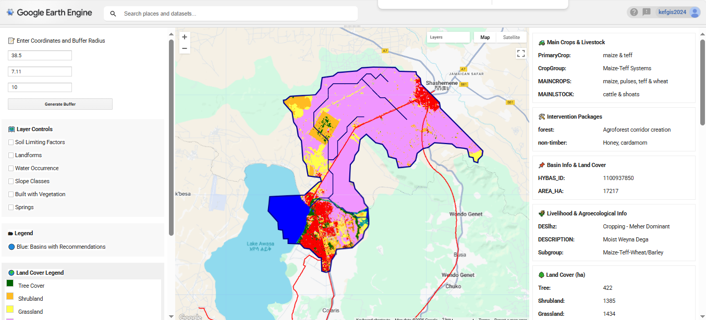
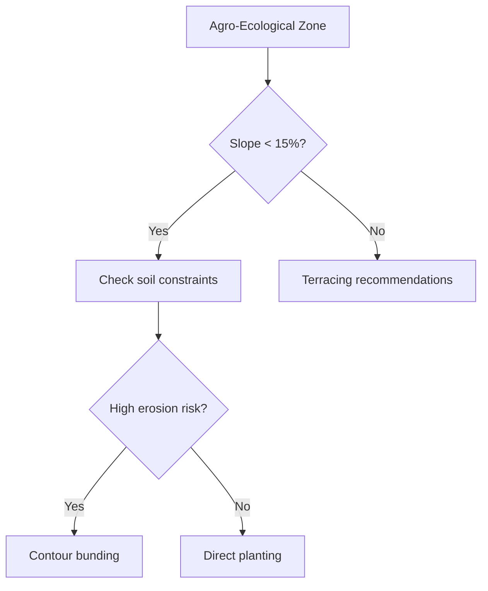

# 🌍 EthioSoilWaterDSS  
**Soil & Water Conservation Decision Support System for Ethiopia**  
An Earth Engine-powered tool for basin-level analysis and intervention recommendations.

  

---

## 🧭 Overview  
EthioSoilWaterDSS is an interactive web application designed to support sustainable land management decisions in Ethiopia. Built on Google Earth Engine, it enables planners and conservation specialists to assess basin-level conditions and recommend tailored interventions.

---

## 📑 Table of Contents  
1. [Introduction](#introduction)  
2. [Objectives](#objectives)  
3. [Material and Methods](#material-and-methods)  
4. [Workflow](#workflow)  
5. [How to Use](#how-to-use)  
6. [Data Sources](#data-sources)  
7. [License](#license)  
8. [Way Forward](#way-forward)

---

## 🧩 Introduction  
This tool integrates multi-source geospatial datasets to deliver:
- Land capability assessments  
- Soil constraint mapping  
- Intervention package recommendations  
- Livelihood zone characterizations  

**Target Users:** Agricultural planners, conservation specialists, and development agencies working in water-stressed regions.

---

## 🎯 Objectives  
- Identify suitable agricultural interventions at the basin scale  
- Quantify land cover and soil constraints  
- Provide distance-to-resource metrics  
- Generate printable basin assessment reports  
- Support sustainable land management decisions

---

## 🛠️ Material and Methods  

### 🌍 Geographic Extent  
- **Coverage:** Continental Africa  
- **Spatial Resolution:** 10m–250m (dataset-dependent)  
- **Projection:** WGS 84 (EPSG:4326)

### 📊 Data and Sources

| Dataset              | Source               | Resolution | Description                          |
|----------------------|----------------------|------------|--------------------------------------|
| HydroATLAS Basins    | WWF                  | Level 10   | Hydrological basins                  |
| Land Cover           | ESA WorldCover       | 10m        | 2020 land classification             |
| Soil Constraints     | ISDASOIL Africa      | 250m       | Fertility capability classification |
| Terrain              | Copernicus DEM       | 30m        | Digital elevation model              |
| Surface Water        | JRC Global Surface Water | 30m    | Water occurrence                     |
| Slope                | DEM                  | 30m        |                       |
| Agro-ecology         | DEM and Rainfall     | 90m        |                         |
| Livlihood zones 2018 | Ethiopia - Livelihood Zones (January 2018) - ReliefWeb         | Vector     |                         |
| HydroATLAS Basins    | WWF                  | Level 10   | Hydrological basins                  |

### 📐 Criteria and Recommendations  
The tool applies rule-based classification to suggest interventions:

---

## 🔄 Workflow  
1. User inputs coordinates and buffer radius  
2. System generates basin boundaries  
3. Multi-criteria analysis runs automatically:
   - Land cover classification  
   - Soil constraint mapping  
   - Terrain analysis  
   - Infrastructure proximity  
4. Results populate interactive panels  
5. User selects basins for detailed reports

---

## 🖱️ How to Use  

### 🔧 Input Parameters  
- Enter decimal degree coordinates  
- Specify buffer radius (meters)  
- Click **Generate Buffer**

### 🗺️ Map Interface  
- Toggle layers using checkboxes  
- Select basins from dropdown  
- Click features for details

### 📤 Output Panels  
- **Left:** Analysis controls  
- **Center:** Interactive map  
- **Right:** Detailed basin reports

### 📦 Export Options  
- **Screenshot:** Use browser capture tools  
- **Data:** Export via Earth Engine functions

---

## 🌐 Data Sources  
All datasets are publicly available via:
- [Google Earth Engine Data Catalog](https://developers.google.com/earth-engine/datasets)
- [HydroATLAS](https://www.hydrosheds.org/pages/hydroatlas)
- [ESA WorldCover](https://worldcover2020.esa.int)

---

## 📜 License  
This project is licensed under the MIT License. See [LICENSE.md](LICENSE.md) for details.

---

## 🚀 Way Forward  

### Short-term  
- Add export-to-PDF functionality  
- Integrate climate risk indicators  
- Include crop suitability models

### Long-term  
- Mobile application version  
- User management system  
- API for integration with farm management software

---

**Developed by [KSK, A, and W] using Google Earth Engine.**  

---
